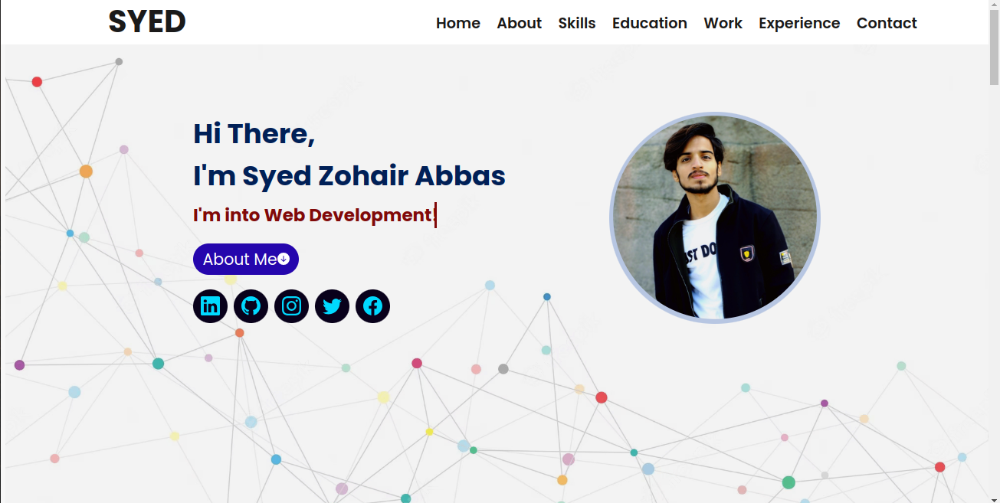
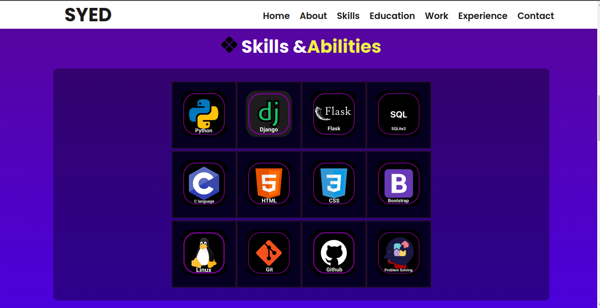

# Syed's Portfolio

Welcome to Syed's Portfolio! This is a brief showcase of my skills and work.

## Table of Contents
- [Overview](#overview)
- [Features](#features)
- [Installation](#installation)
- [Usage](#usage)
- [Screenshots](#screenshots)
- [Contributing](#contributing)
- [License](#license)

## Overview
Syed's Portfolio is a personal website that highlights my professional skills and showcases my projects.

## Features
- Professional portfolio display
- Showcasing skills and achievements
- Portfolio project display

## Installation
No installation is required for this portfolio. You can access it via your web browser.

## Usage
To use this portfolio:
1. Clone this repository to your local machine.
2. Open `index.html` in your web browser.

## Screenshots

Above are the screenshots of the portfolio and skills sections.

## Contributing
Contributions are welcome! Please follow the [Contributing Guidelines](CONTRIBUTING.md) for more details.

## License
This project is licensed under the MIT License - see the [LICENSE.md](LICENSE.md) file for details.
