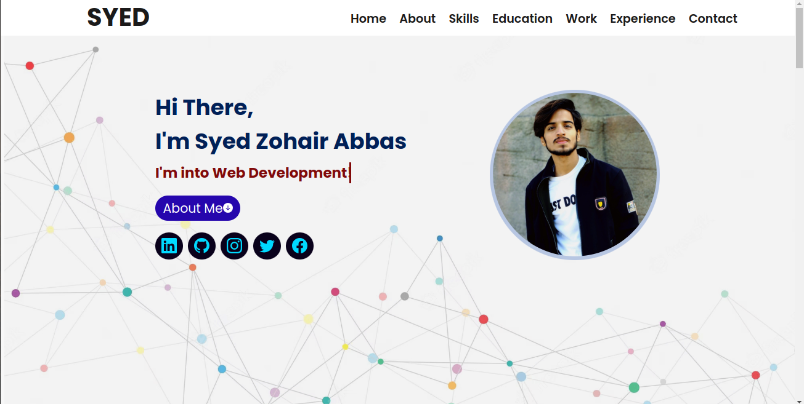
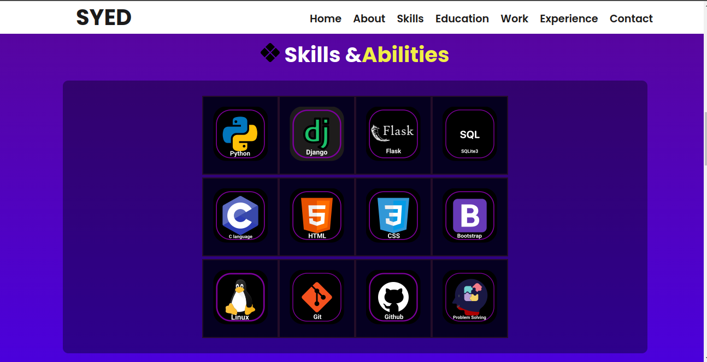

# Syed's Portfolio

Welcome to Syed's Portfolio! This is a brief showcase of my skills and work.

## Table of Contents
- [Overview](#overview)
- [Features](#features)
- [Screenshots](#screenshots)

## Overview
Syed's Portfolio is a personal website that highlights my professional skills and showcases my projects.

## Features
- Professional portfolio display
- Showcasing skills and achievements
- Portfolio project display

## Screenshots

Above are the screenshots of the portfolio and skills sections.

NOTE: MAKE THESE CHANGES TO YOUR CODE IN settings.py File

EMAIL_HOST_USER = "replace it with your email" 
EMAIL_HOST_PASSWORD = "replace it with your app password"  

CONTACT_EMAIL = 'replace it with your email'  
DEFAULT_FROM_EMAIL = 'replace it with your email'  
